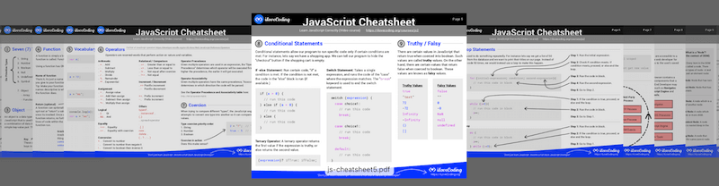
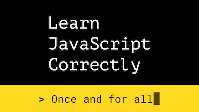

# 🔥 JavaScript Cheatsheet 🗺️

This is the cheatsheet for the foundational concepts of JavaScript. Get to learn the fundamental concepts, syntax, terminologies and different constructs in JavaScript. 

Bonus: One-Page DOM API cheatsheet on section 14.

Want to learn JavaScript correctly? [here's an awesome video course](https://ilovecoding.org/courses/js2) for iLoveCoding Pro members.

## I present to you - The JavaScript Cheatsheet 💪

[Download the full 13-page PDF](js-cheatsheet.pdf)

or
Download individual pages:

- Page 1: Basic Vocabulary, Seven Types, Objects
[PNG](js-cheatsheet1.png), [PDF](js-cheatsheet1.pdf)
- Page 2: Functions - parameters, invocation, parameters, return and more.
[PNG](js-cheatsheet2.png), [PDF](js-cheatsheet2.pdf)
- Page 3: Vocabulary around variables and scope
[PNG](js-cheatsheet3.png), [PDF](js-cheatsheet3.pdf)
- Page 4: Operators and coercion
[PNG](js-cheatsheet4.png), [PDF](js-cheatsheet4.pdf)
- Page 5: Conditional Statement (if/switch/ternary) + Truthy Falsy
[PNG](js-cheatsheet5.png), [PDF](js-cheatsheet5.pdf)
- Page 6: Loops - For, While, Do While
[PNG](js-cheatsheet6.png), [PDF](js-cheatsheet6.pdf)
- Page 7: Ways to create variable - var, let, const + Event Loop
[PNG](js-cheatsheet7.png), [PDF](js-cheatsheet7.pdf)
- Page 8: Browser
[PNG](js-cheatsheet8.png), [PDF](js-cheatsheet8.pdf)
- Page 9: DOM - Query, Create, Update, Delete, Events of DOM
[PNG](js-cheatsheet9.png), [PDF](js-cheatsheet9.pdf)
- Page 10: Auto-inherited properties + built-in objects
[PNG](js-cheatsheet10.png), [PDF](js-cheatsheet10.pdf)
- Page 11: Promise and Async Tasks
[PNG](js-cheatsheet11.png), [PDF](js-cheatsheet11.pdf)
- Page 12: 'this' keyword and 3 scenarios to remember
[PNG](js-cheatsheet12.png), [PDF](js-cheatsheet12.pdf)
- Page 13: Constructors - Custom and built-in constructors
[PNG](js-cheatsheet13.png), [PDF](js-cheatsheet13.pdf)

## Change log:

- Nov 16, 2018: Added page 10-13 to the cheatsheet
  Topics added:
  - Page 10: Auto-inherited properties + built-in objects
  - Page 11: Promise and Async Tasks
  - Page 12: 'this' keyword and 3 scenarios to remember
  - Page 13: Constructors - Custom and built-in constructors
- Oct 25, 2018: Launched 9-page cheatsheet

## 👍 Want to learn JavaScript correctly?

Try the most comprehensive beginner to advanced JavaScript video course -> [Learn JavaScript Correctly](https://ilovecoding.org/courses/js2) on iLoveCoding Pro.

Don't just learn JavaScript, think and build like a full-stack JavaScript developer.

## Other Cheatsheets:

- [HTML Cheatsheet](https://github.com/iLoveCodingOrg/html-cheatsheet)
- [CSS Cheatsheet](https://github.com/iLoveCodingOrg/css-cheatsheet)
